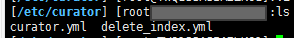
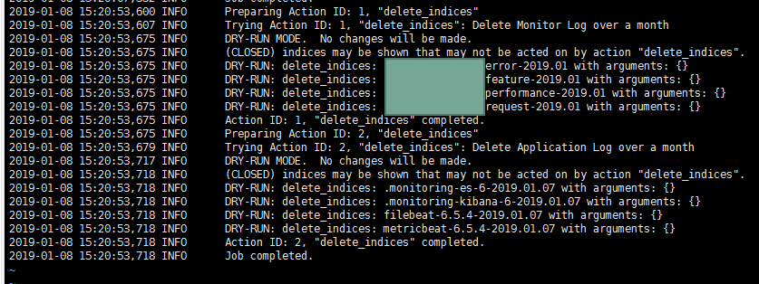

# Curator

Curator 是一個管理 ElasticSearch Index 的工具 我們可以透過設定的方法讓她每天執行 並且 Delete or Relocat or Close Index ,並且她也是官方所提供的套件

### Setting Curator

根據前面我們的安裝設定，我們將 Curator 安裝完成後，我們在/etc folder 底下 Create 一個 Curator folder

**然後 我們在此 folder 底下 vi Curator.yml 將以下設定放到 Curator.yml 裡面**

Curator.yml

```
client:
  hosts:
    - 你的server Ip
  port: 9200
  url_prefix:
  use_ssl: False
  certificate:
  client_cert:
  client_key:
  ssl_no_validate: False
  http_auth:
  timeout: 30
  master_only: False

logging:
  loglevel: INFO
  logfile: /var/log/curator.log
  logformat: default
  blacklist: ['elasticsearch', 'urllib3']
```

> 注意 我們 logging 需要 這樣才有辦法看 log 去判斷有沒有誤刪



## 設定 Delete Index 的 Job

假設我們有以下這些 index

- sampleIndex-request-2019.03
- sampleIndex-performance-2019.03
- sampleIndex-feature-2019.03
- sampleIndex-request-2019.04
- sampleIndex-performance-2019.04
- sampleIndex-feature-2019.04
- filebeat-6.5.4-2019.01.17
- filebeat-6.5.4-2019.01.18
- filebeat-6.5.4-2019.01.19
- metricbeat-6.5.4-2019.01.17
- metricbeat-6.5.4-2019.01.18
- metricbeat-6.5.4-2019.01.19

我們可以知道 我們 index 的命名方法是有兩種 一種是 by day 一種是 by week

假設我們目標是

**刪除 by week 的 index 超過 7 天的資料**

**刪除 by day 的 index 超過 1 天的資料**

所以我們在 create 我們的 delete index job 就需要設定兩種不同的刪除判斷式

**我們 vi delete_index.yml 將以下設定放到 delete_index.yml 裡面**

```
actions:
  1:
    action: delete_indices
    description: >-
      Delete Monitor Log over a week
    options:
      ignore_empty_list: True
      disable_action: False
    filters:
    - filtertype: pattern
      kind: timestring
      value: '%Y.%m.%d'
      exclude: True
    - filtertype: age
      source: name
      direction: older
      timestring: '%Y.%W'
      unit: days
	  unit_count: 7
  2:
    action: delete_indices
    description: >-
      Delete Application Log over a day
    options:
      ignore_empty_list: True
      disable_action: False
    filters:
    - filtertype: age
      source: name
      direction: older
      timestring: '%Y.%m.%d'
      unit: days
      unit_count: 1
```

**action**
每一個編號代表一個指令

- action: 執行什麼指令
- option: 選項
- filter: 要指定或是排除什麼樣的 index 條件

這裡要注意 她是依照順序去執行 job,所以有執行順序記得排序

**我們是用 1 ,2 去區分不同的 Job**

**我們先來看 1. **

1. 的對應就是想要刪除 過去七天的資料 她想要對應的 index pattern 是下面

- sampleIndex-request-2019.03
- sampleIndex-performance-2019.03
- sampleIndex-feature-2019.03
- sampleIndex-request-2019.04
- sampleIndex-performance-2019.04
- sampleIndex-feature-2019.04

> action: delete_indices 這是我們想要執行的指令 這是固定的

可以用的指令如下:

```
Commands:
  allocation        Shard Routing Allocation
  close             Close indices
  delete_indices    Delete indices
  delete_snapshots  Delete snapshots
  forcemerge        forceMerge index/shard segments
  open              Open indices
  replicas          Change replica count
  show_indices      Show indices
  show_snapshots    Show snapshots
  snapshot          Snapshot indices
```

接著

```
options:
      ignore_empty_list: True
      disable_action: False
```

> ignore_empty_list :這是指說萬一沒有撈到 index 不會停在這個 job 她還是會往下繼續把所有的設定做完，如果設定成 False, 她只要這個指令的動作沒有任何執行指令接下來都會停住

```
filters:
- filtertype: pattern
    kind: timestring
    value: '%Y.%m.%d'
    exclude: True
- filtertype: age
    source: name
    direction: older
    timestring: '%Y.%W'
    unit: days
    unit_count: 7
```

> 這裡我們做兩個設定
>
> 1. 排除 yyyy.mm.dd 格式的 index pattern ,設定成 exclude :true
> 2. 然後透過 index 裡面的@timestamp 欄位 以及 pattern 格式 判斷只留最近七天內的資料，超過刪除掉
> 3. [age setting](https://www.elastic.co/guide/en/elasticsearch/client/curator/current/filtertype_age.html)
>    這就是 1 的設定

**我們再來看 2. **

```
filters:
- filtertype: age
    source: name
    direction: older
    timestring: '%Y.%m.%d'
    unit: days
    unit_count: 1
```

> 這裡我們做一個設定
> 只讓 yyyy.mm.dd 格式的 index pattern ,保留一天的資料

這樣就設定完成了

## 測試 delete index

我們設定完成這些 Job 的時候 我們需要做測試

```
curator --config /etc/curator/curator.yml --dry-run /etc/curator/delete_index.yml
```

> 特別注意 我們一定要下--dry-run 她會假裝執行 實際上 她不會去刪除資料

接著我們去剛剛我們設定的 log 位置看資料

```
vi /var/log/curator.log
```

下面是範例 可以對照看看是否是你需要的結果，如果是正確的話就可以放到 schedule job 去執行了


## 設定成 Schedule Job

```
vi /etc/crontab
```

將以下指令貼到下面即可,她就會每天執行

```
0 0 * * * root curator --config /etc/curator/curator.yml  /etc/curator/delete_index.yml
```

# Reference

https://blog.csdn.net/u013613428/article/details/78229090

http://www.madhur.co.in/blog/2017/04/09/usingcuratordeleteelasticindex.html

https://www.elastic.co/guide/en/elasticsearch/client/curator/current/filtertype_age.html

https://www.elastic.co/guide/en/elasticsearch/client/curator/current/fe_timestring.html
