# Metricbeat

Metricbeat 是一個輕量化的資料收集器 ，他提供了很多 module，可以把系統的狀態 或是 application 的狀態直接送到 elasticsearch or logstash,並且提供許多內建的 Dashboard 給我們看

MetricBeat Dashboard List:
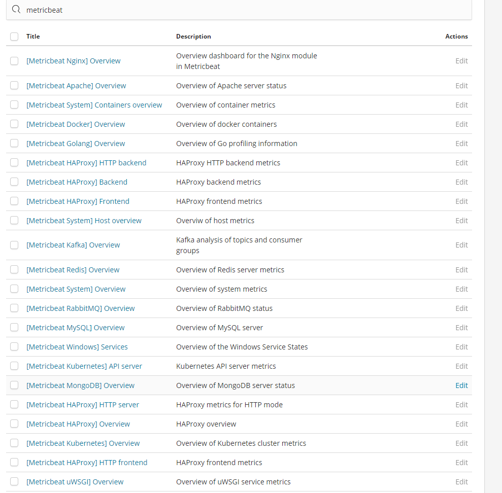

System Overview Dasboard
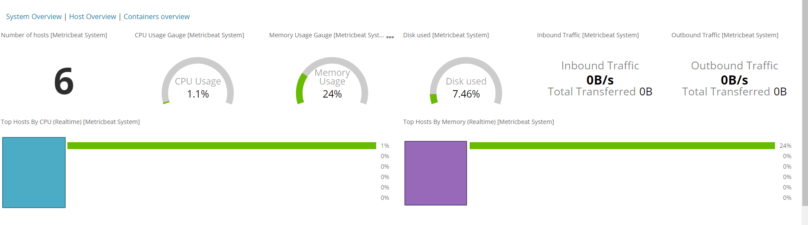

System Dasboard
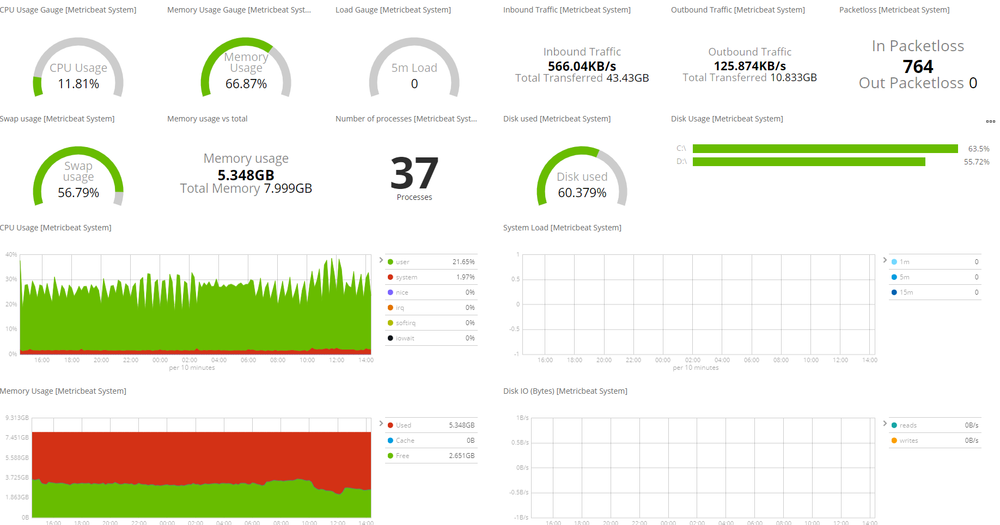

Service Dashbobard
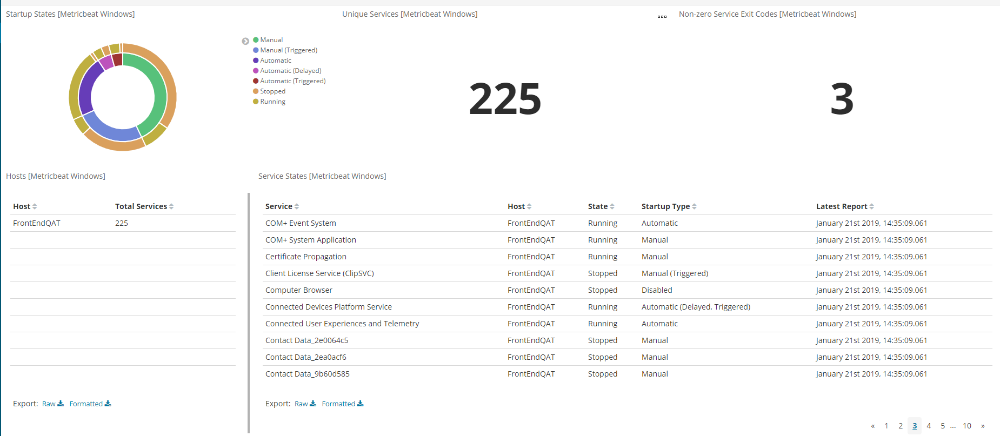

Redis Dashboard
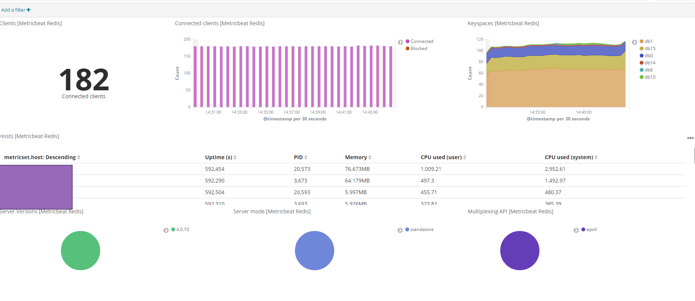

## Metricbeat Setting

### Windows Setting

首先去我們安裝好的位置 修改 metricbeat.yml

```
#================================ General =====================================

# The name of the shipper that publishes the network data. It can be used to group
# all the transactions sent by a single shipper in the web interface.
name: "Testing"
#-------------------------- Elasticsearch output ------------------------------
output.elasticsearch:
  # Array of hosts to connect to.
  hosts: ["xxxxx:9200"]
```

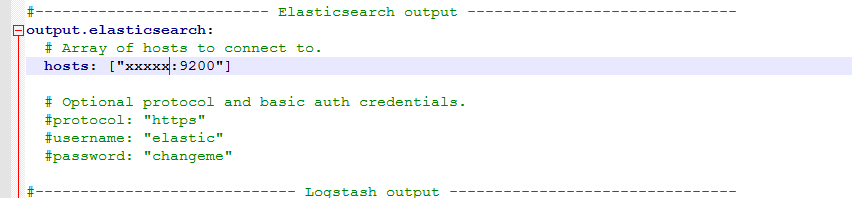

接著透過 我們可以知道 預設只有 system 以及 windows 這個模組被開啟

```
metricbeat modules list
```

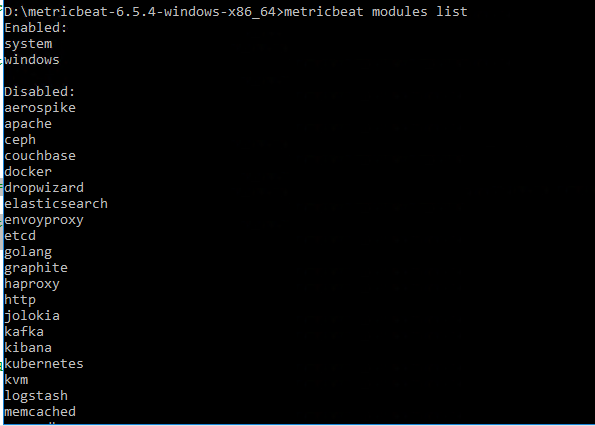

所以我們需要 enable 內建的一些模組必須要下以下的指令

```
metricbeat modules enable logstash
metricbeat modules enable elasticsearch
metricbeat modules enable redis
```

### Linux Setting

首先我們先要編輯 去設定輸出到 es 的位置

```
vi /etc/metricbeat/metricbeat.yml
```

修改下面這區塊

```
#-------------------------- Elasticsearch output ------------------------------
output.elasticsearch:
  # Array of hosts to connect to.
  hosts: ["xxxxx:9200"]

  # Optional protocol and basic auth credentials.
  #protocol: "https"
  #username: "elastic"
  #password: "changeme"
```

> 如果我們希望輸出到 elasticsearch 後的欄位他有自己的名稱(beat.name = qat or uat)
> 我們可以透過設定 name 他就可以修改成特別的 beat.name (預設是 server name)
> 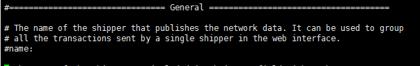

接著透過 我們可以知道 預設只有 system 這個模組被開啟

```
metricbeat modules list
```

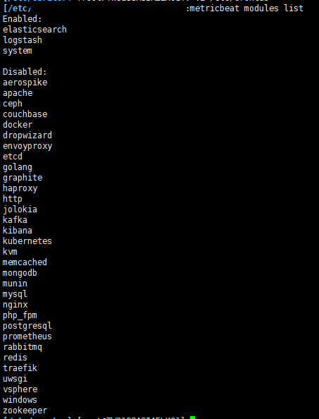

所以我們需要 enable 內建的一些模組必須要下以下的指令

```
metricbeat modules enable logstash
metricbeat modules enable elasticsearch
metricbeat modules enable redis
```

接著我們可以去安裝的路徑底下的 modules.d 去看
我們 enable 的 module 是不是副檔名變成.yml

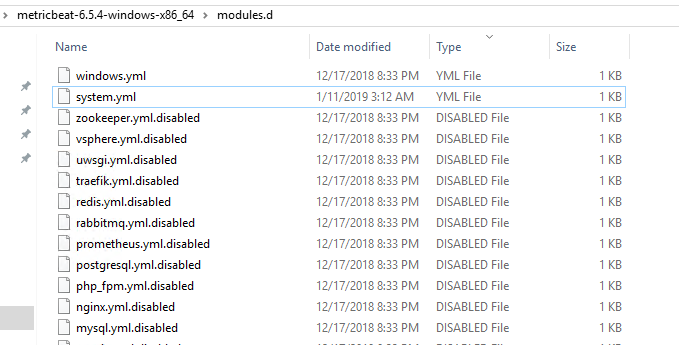

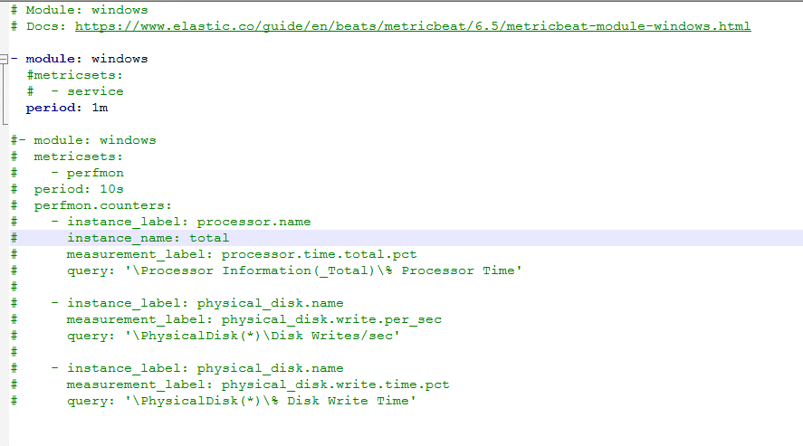

```
# Module: redis
# Docs: https://www.elastic.co/guide/en/beats/metricbeat/6.5/metricbeat-module-redis.html

- module: redis
  metricsets:
    - info
    - keyspace
  period: 60s

  # Redis hosts
  hosts: ["xxxx:8188"]

  # Network type to be used for redis connection. Default: tcp
  #network: tcp

  # Max number of concurrent connections. Default: 10
  #maxconn: 10

  # Redis AUTH password. Empty by default.
  password: Cache

- module: redis
  metricsets:
    - info
    - keyspace
  period: 10s

  # Redis hosts
  hosts: ["xxxx:6666"]

  # Network type to be used for redis connection. Default: tcp
  #network: tcp

  # Max number of concurrent connections. Default: 10
  #maxconn: 10

  # Redis AUTH password. Empty by default.
  password: message


```

> 這裡代表是 我們在同一台 server 安裝了多個 redis 的 instance
> period: 我們可以設定他幾秒打一次到 redis

設定完不要忘記重開 metricbeat

```
systemctl restart metricbeat.service
```

接著我們應該就可以在 elk 裡面看到資料，如果沒有 Dashboard 請參考下一節的 export dashboard to elk


## Metricbeat Export Dashboard to ELK

簡單來講就是透過任何一個安裝好的 metricbeat agent 把裡面內建的 dashboard 匯出到 elk

```
metricbeat setup -e `-E output.elasticsearch.host=[xxxx:9200] -E setup.kibana.host'xxxx:5601' `  --dashboards
```

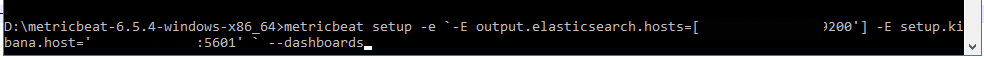

成功後應該會再 elk 看面看到
MetricBeat Dashboard List:


### Reference:

https://www.elastic.co/guide/en/beats/devguide/6.x/import-dashboards.html

https://www.itread01.com/content/1532958197.html
