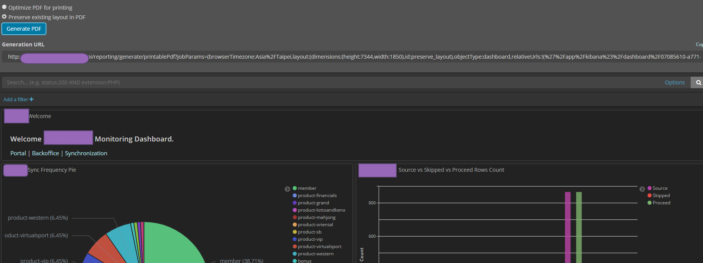

# 此功能為需要購買 X-Pack 權限才可以使用的功能

# 目前只能使用查詢條件查詢

[基本介紹](https://www.elastic.co/guide/en/x-pack/current/xpack-alerting.html)

首先我們要先知道怎麼設定查詢的條件

這裡必須要知道怎麼去查詢 elasticsearch api 的 query,這裡不多說明

舉例來說

```
GET weblog-2019.11/_search/
{

 "query": {
            "bool": {
              "must": [
                {
                  "match": {
                    "module": "webspi"
                  }
                },
                {
                  "match": {
                    "method": "/spi/getmembercashlog"
                  }
                }
              ],
              "must_not": [
                {
                  "range": {
                    "responsetime": {
                      "gte": 0,
                      "lte": 20000
                    }
                  }
                },
                {
                  "match": {
                    "module": "webspi"
                  }
                },
                {
                  "match": {
                    "method": "/signalr/poll"
                  }
                }
              ],
              "filter": {
                "range": {
                  "@timestamp": {
                    "from": "now-5m"
                  }
                }
              }
            }
          },
 "aggs": {
            "slow_module": {
              "terms": {
                "field": "module.keyword"
              },
              "aggs": {
                "my_bucket_filter": {
                  "bucket_selector": {
                    "buckets_path": {
                      "doccount": "_count"
                    },
                    "script": {
                      "source": "params.doccount >= 10"
                    }
                  }
                }
              }
            }
          }

}
```

> 我們可以設定 query 要哪一個條件的資料 要符合哪一個欄位 並且他的數值是什麼 以及 是過去幾分鐘的，這裡要特別注意 要根據 index 去搜尋 避免造成他搜尋的效能問題

我們可以透過 Dev Tools 去查詢資料 會得到下面的結果


> 這裡只列出一些大概的資料 更詳細的部分請各位自己去查詢 他會告訴你時間以及找到的筆數

# Watcher 介紹

Wacher 在 Management 裡面可以設定

裡面有分 threshold alert & advancedwatch.

因為 advancedwatch 可以自訂比較多的功能 所以以介紹這個為主


基本上按了 Add 以後會看到這個畫面


## 基礎他有分成幾塊

- trigger :代表是重複執行的時間
- input :查詢的條件
- condition : 設定什麼條件會 match
- action: 要執行什麼動作

## Trigger

控制觸發的時間以及遞迴的時間

每十分鐘觸發

```
"trigger" : {
  "schedule" : { "interval" : "10m" }
}
```

每天五點觸發 (不管你的時區 這是以 GMT +0 的時間為準)

```
"trigger" : {
  "schedule" : {
    "daily" : { "at" : "17:00" }
  }
}
```

[完整教學](https://www.elastic.co/guide/en/x-pack/current/trigger-schedule.html)

## input 主要是你判斷條件的來源

simple: 讀取靜態內容
search: 讀取查詢語句執行後的返回結果
http: 讀取 HTTP 請求的返回結果
chain: 用來自由組合使用上面三種類型組成的多個 input

[原文網址](https://kknews.cc/zh-tw/other/89b5gzq.html)
這裡我們用的是 search

例子就像下面這樣
[詳細語法](https://www.elastic.co/guide/en/elasticsearch/reference/6.6/search.html)

```
"input": {
    "search": {
      "request": {
        "search_type": "query_then_fetch",
        "indices": ["xxxx-aplication"],
        "types": [],
        "body": {
          "query": {
                "bool": {
                    "must": [
                        {
                        "match": {
                            "method": "login"
                        }
                        },

                        {
                        "match": {
                            "module.keyword": "web.ngstar"
                        }
                        },
                        {
                        "range": {
                            "@timestamp": {
                            "gte": "now-10m"
                            }
                        }
                        }
                    ]
                }
            }
        }
      }
    }
  }
```

> 最主要的 query 都在這裡請看條件是

> Method = Login and index= xxxx-application

> 時間是 現在到過去十分鐘

如果不確定可以把剛剛上面 body 裡面的 query 往 dev tools 丟看看 如上圖 就可以看到結果

> 記得選 index 以及設定對的時間,


回傳的資料會像這樣 他會告訴你回多少筆以及列出一些資料

```
{
  "took": 11,
  "timed_out": false,
  "_shards": {
    "total": 4,
    "successful": 4,
    "skipped": 0,
    "failed": 0
  },
  "hits": {
    "total": 5648,
    "max_score": 2.9355528,
    "hits": [
  .....
    ]}
}

```

我們再來看一個更進階的查詢

我們希望找到過去一小時 是中國的資料然後 group by memberCode (distint) 產生出一個新的欄位

```
 "input": {
    "search": {
      "request": {
        "search_type": "query_then_fetch",
        "indices": [],
        "types": [
          "request"
        ],
        "body": {
         "query": {
            "bool": {
              "must": [
                {
                  "exists": {
                    "field": "membercode.keyword"
                  }
                },
                {
                  "range": {
                    "@timestamp": {
                      "gte": "now-60m"
                    }
                  }
                },
                {
                  "match": {
                    "geoip.country_name": "China"
                  }
                },
                {
                  "match":{
                    "httpmethod": "OUTPUT"
                  }
                }
              ]
            }
          },
          "aggs": {
            "distinct_membercode": {
              "cardinality": {
                "field": "membercode.keyword"
              }
            }
          }
        }
      }
    }
  }

```

我們可以看到這裡查詢後就多了這個欄位可以提供我們使用 接下來要判斷或是 action 都可以用


## condition

決定之後的 [actions](https://www.elastic.co/guide/en/x-pack/current/condition.html) 執行的條件

判斷我們剛剛講的 distinct_membercode 在一小時內低於 300 就觸發

```
"condition": {
    "compare": {
      "ctx.payload.aggregations.distinct_membercode.value": {
        "lte": 300
      }
    }
  }
```

或是每次都觸發

```
"condition" : {
  "always" : {}
}
```

## actions

裡面有許多可以使用的[actions](https://www.elastic.co/guide/en/x-pack/current/actions.html), 我認為最常使用的應該是 webhook,email,logging

### Email

**如果要寄信需要設定 MAIL SERVER 的認證**
**這裡的值**
[參考](https://www.elastic.co/guide/en/x-pack/current/actions-email.html)

這裡就可以看到寄信的內容

```
    "send_email": {
      "email": {
        "profile": "standard",
        "to": [
          "XXXX@gmail.com"
        ],
        "subject": "China Member Less than 1000 in one hour",
        "body": {
          "text": " {{ctx.payload.aggregations.distinct_membercode.value}}. Threshold is 1000."
        }
      }
    }
```

### Email With Attachment

這裡要特殊說明一下 我們希望做到的事情 就是 Auto Generate Report from ELK Dashboard, 並且寄信給 User


[參考](https://www.elastic.co/guide/en/kibana/current/
automating-report-generation.html)

1. 我們要把 上圖的網址 copy 起來

2. 設定 wacher job, 看你要多久跑一次

3. 設定重試的次數 以及 帳號密碼(此帳號一定要有 report_user 的權限 不然會失敗)

```
  "actions" : {
    "email_admin" : {
      "email": {
        "to": "xxxx,
        "subject": "Error Monitoring Report",
        "attachments" : {
          "error_report.pdf" : {
            "reporting" : {
              "url": "dashboard裡面點下report copy那個url ",
              "retries":6,
              "interval":"10s",
              "auth":{
                "basic":{
                  "username":"帳號",
                  "password":"密碼"
                }
              }
            }
          }
        }
      }
    }
  }
```

設定完後 回到 watcher 這裡 密碼會被蓋住，這裡無法被模擬


這裡可以先設定短時間重複產生測試看看，避免無法模擬的狀況，成功後就可以收到信件內有附件

### Log

這裡的 Log 都是產生在 es 的標準 Log ,並不會存在特定的 index 內

[參考](https://www.elastic.co/guide/en/x-pack/current/actions-logging.html)

```

"log": {
      "logging": {
        "level": "info",
        "text": "There are {{ctx.payload.aggregations.distinct_membercode.value}} documents in your index. Threshold is 1000."
      }
    }
```

### Webhook

這裡也可以設定自己想要 hook 的 api 下面例子是以 skype 為例:

[參考](https://www.elastic.co/guide/en/x-pack/current/actions-webhook.html)

```
"skype_notify": {
      "webhook": {
        "scheme": "http",
        "host": "",
        "port": 8081,
        "method": "get",
        "path": "/",
        "params": {
          "msg": "系統出現{{ctx.payload.hits.total}}個錯誤\nMore than {{ctx.payload.hits.total}} errors found in 1 min.\n查看ELK http://xxxxx",
          "to": "xxxxx"
        },
        "headers": {}
      }
    }
```

## Simulate

當前面設定都設定好後可以用這個來模擬我們的結果


如果要看更多請去官方看他的設定

# Referenece:

https://kknews.cc/zh-tw/other/89b5gzq.html

```

```
