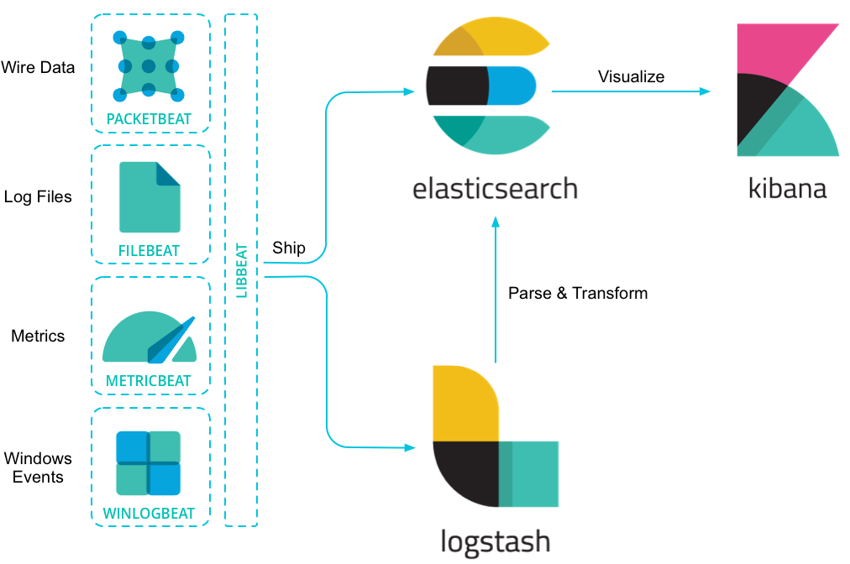

# Elastic Stack guide

### What is Elastic Stack ?

- ELK Stack 是從 5 版開始的正式名稱 ，5 版之前都統稱為 ELK,並沒有包含 beats
- ELK Stack 是由這些 ElasticSearch ,Kibana,Logstash ,beats (metricbeats,filebeat,winlogbeat....)組合而成
- Elasticsearch : A distributed, RESTful search and analytics database
- Logstash : Ingest data, processing, and send it to elasticsearch
- Kibana : UI for search and visualize Elasticsearch data
- Beats: collecting logs tools, for most application or server use , and pass to Elasticsearch or Logstash using
- X-pack: Need License , use to monitor ELK Stack and do permission control

### Why Elastic Stack?

- Open source
- Provide a lot of beats collect for server logs or application logs . No need to custom our own
- Elasticsearch is no sql db and Full-text index for user to search data
- Elasticsearch easy to extend the cluster and Logstash also easy to extend the cluster for large data input and store.
- Kibana Provide a easy way to display data and store the dashboard ,monitor the system information

- Chap 3 Logstash Config

   - [Logstash Config](../logstash/logstatchConfig.md)
   - [Logstash Config Structure](../logstash/logstatchConfigStructure.md)

## Reference:

https://elkguide.elasticsearch.cn/
